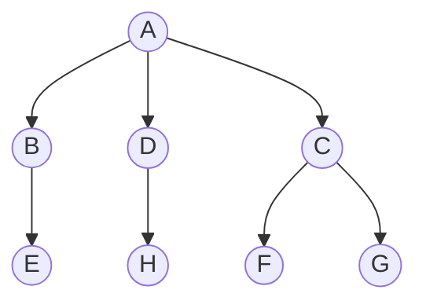

Reference:

[Efficient Graph-Based Image Segmentation,IJCV 2004,MIT](http://cs.brown.edu/people/pfelzens/papers/seg-ijcv.pdf)

[source code](http://cs.brown.edu/people/pfelzens/segment/)

------
&emsp;&emsp;Graph-Based Segmentation是经典的基于图的贪心聚类算法，该算法的核心思想就是将输入图像抽象为加权图，将图像分割问题转换为图？？？问题来解决。

## 前置知识

### 图的概念

#### 图的定义

> &emsp;&emsp;图论是数学中以图为研究对象的理论分支，图论中的图是由若干给定的点及连接两点的线所构成的图形，这种结构通常用来描述对象之间的某种特定关系，用点代表对象，用连接两点的线表示对象之间的关系，显然，图是可以描述多个对象的关系。
> 
> &emsp;&emsp;图由顶点集$V$(vertices)和边集$E$(edges)组成，其数学表示如下：
> $$G = \left \langle u,v \right \rangle$$
> 
> &emsp;&emsp;图可以分为有向图和无向图，在图中：
>  
> + $(v,w)$表示无向边，即$v$和$w$是互通的
> + $\left \langle u,v \right \rangle$表示有向边，即该边始于$v$，终于$w$
>
> 图也可以分为有权图和无权图：
> + 有权图：每条边具有一定的权重
> + 无权图：每条边均没有权重，也可以认为权重为1
>
> 图的顶点有度的概念:
> + 度（degree）：所有与某个顶点连接的顶点个数之和
> + 入度（indegree）：存在于有向图中，所有接入该点的边数之和
> + 出度（outdegree）：存在于有向图之中，所有接出该点的边数之和

#### 图在编程中的表示方法
+ 邻接矩阵
  + 一个n个顶点的图需要一个$n \times n$大小的矩阵来表示
  + 在一个无权图中，矩阵坐标中每个位置值为1代表两个顶点式相连的，0表示两点不相连
  + 在一个有权图中，矩阵坐标中每个位置值代表两点之间的权重，0表示两点不想连
+ 邻接链表
  + 对于每个点，存储着一个链表，用来指向所有与该点直接相连的点
  + 对于有权图，链表中元素值对应着权重

无向无权图：

无向有权图：

有向无权图：

> + 可以看出在无向图中，邻接矩阵关于对角线对称，而邻接链表总有两条对称的边;
> 
> + 邻接矩阵由于没有相连的边也占有空间，因此存在浪费空间的问题，而邻接链表则比较合理地利用空间
> 
> + 邻接链表需要牺牲很大的时间来查找，因此比较耗时，而邻接矩阵法相比邻接链表法来说，时间复杂度低。

#### 图的遍历
&emsp;&emsp;图的遍历就是要找出图中的所有顶点，常见的遍历算法如下：
+ 深度优先遍历（Depth First Search,DFS）

    > 
    > &emsp;&emsp;主要思路是从图中一个未访问的顶点 V 开始，沿着一条路一直走到底，然后从这条路尽头的节点回退到上一个节点，再从另一条路开始走到底...，不断递归重复此过程，直到所有的顶点都遍历完成，它的特点是不撞南墙不回头，先走完一条路，再换一条路继续走。
    > 
    > 算法步骤:
    > + 访问顶点 v
    > + 从 v 的未被访问的邻接点中选取一个顶点 w，从 w 出发进行深度优先遍历
    > + 重复上述两步，直至图中所有和v有路径相通的顶点都被访问到
    > 

+ 广度优先搜索(Breadth First Search, BFS)
    >
    >&emsp;&emsp;指的是从图的一个未遍历的节点出发，先遍历这个节点的相邻节点，再依次遍历每个相邻节点的相邻节点，需要一个队列来保存遍历过的顶点顺序，以便按出队的顺序再去访问这些顶点的邻接顶点。
    > 
    > 算法步骤:
    > + 顶点$v$入队列
    > + 当队列非空时则继续执行，否则算法结束
    > + 出队列取得队头顶点$v$；访问顶点$v$并标记顶点$v$已被访问
    > + 查找顶点$v$的第一个邻接顶点col
    > + 若$v$的邻接顶点col未被访问过的，则col继续
    > + 查找顶点$v$的另一个新的邻接顶点col，转到步骤5入队列，直到顶点$v$的所有未被访问过的邻接点处理完，转到步骤2。

#### 树

&emsp;&emsp;树是一种特殊的图，树中的任意两个顶点，都有路径相连接，但是没有回路，如下图:

+ 最小生成树（Minimum Spanning Trees,MST）
&emsp;&emsp;特殊的树，给定需要连接的顶点，选择边权之和最小的树，生成最小生成树的算法有Prim算法、Kruskal算法。
    + 普里姆算法（Prim算法）
        > 算法步骤:
        > + 已知一个加权连通图$G=\{V,E\}$,求其最小生成树
        >   1.设集合$V_{new} = \{x\},x \in V$，$E_{new} =  \{\}$
        >   2.在集合$E$中选取权值最小的边$\left \langle u,v \right \rangle,u \in V_{new},v \notin V_{new}$(如果存在多条满足前述条件即具有相同权值的边，则可选取其中之一)
        >   3.将$v$加入集合$V_{new}$中，将$\left \langle u,v \right \rangle$边加入集合$E_{new}$中；
        >   4.重复步骤2、3直到$V_{new}=V$
      
      显然，Prim算法的时间复杂度为$O(N_v^2)$，$N_v$为集合$V$的元素个数。
    + Kruskal算法
      &emsp;&emsp;该算法需要一个集合来升序存储所有边
      > 算法步骤:
      > 
      > 1.先构造一个只含有$n$个顶点，而边集为空的子图；
      > 2.从边集$E$中选取一条权值最小的边，若该条边的两个顶点分属不同的树，则将其加入子图（也就是说，将这两个顶点分别所在的两棵树合成一棵树）。反之，若该条边的两个顶点已落在同一棵树上，则不可取，而应取下一条权值最小的边再重复上述算法；
      > 3.重复步骤2，直到所有点连通
    Kruskal算法的时间复杂度为$O(N_elog{N_v})$
    
&emsp;&emsp;关于图论的更多内容，可以参考文末的参考文献[2]。此处不再继续展开讨论。

---

###  聚类(Clustering)

&emsp;&emsp;聚类是指把相似的数据划分到一起，具体划分的时候并不关心这一类的标签，目标就是把相似的数据聚合到一起，聚类是一种无监督学习(Unsupervised Learning)方法。

### 并查集

&emsp;&emsp;并查集（Union-find Data Structure）是一种树型的数据结构，用于处理一些不交集（（Disjoint Sets））的合并及查询问题。用集合中的某个元素来代表这个集合，该元素称为集合的代表元，一个集合内的所有元素组织成以代表元为根的树形结构。对于每一个元素 parent[x]指向x在树形结构上的父亲节点。如果x是根节点，则令parent[x] = x。对于查找操作，假设需要确定x所在的的集合，也就是确定集合的代表元，可以沿着parent[x]不断在树形结构中向上移动，直到到达根节点。显然要判断两个元素是否属于同一集合，只需要看他们的代表元是否相同即可。
+ 路径压缩
 &emsp;&emsp;为了加快查找速度，查找时将x到根节点路径上的所有点的parent设为根节点，该优化方法称为压缩路径。使用该优化后，平均复杂度可视为Ackerman函数的反函数，实际应用中可粗略认为其是一个常数。
+ 并查集的操作
  > 1.查找，确定元素属于哪一个子集。它可以被用来确定两个元素是否属于同一子集。
  > 2.合并：将两个子集合并成同一个集合。
  > 3.计算最后有多少个不相交的集合
+ 并查集的应用
&emsp;&emsp;并查集多用在一些有 N 个元素的集合应用问题中，我们通常是在开始时让每个元素构成一个单元素的集合，然后按一定顺序将属于同一组的元素所在的集合合并，其间要反复查找一个元素在哪个集合中。这个过程看似并不复杂，但数据量极大，若用其他的数据结构来描述的话，往往在空间上过大，计算机无法承受，也无法在短时间内计算出结果，所以只能用并查集来处理，其主要应用领域有：
  > 1、维护无向图的连通性。支持判断两个点是否在同一连通块内。
  > 2、判断增加一条边是否会产生环：用在求解最小生成树的Kruskal算法里。

## 参考文献

[1] [图像分割—基于图的图像分割（Graph-Based Image Segmentation）](https://blog.csdn.net/ttransposition/article/details/38024557)

[2] [数据结构与算法 - 图论](https://zhuanlan.zhihu.com/p/25498681)